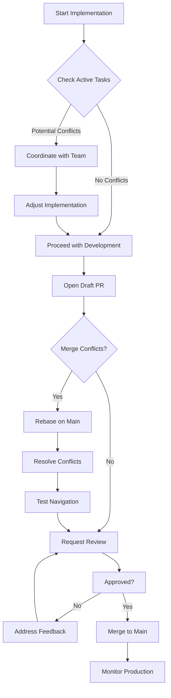

# Conflict Analysis: Task 18 - Merge Projects Section

## Executive Summary

**Task ID**: 18
**Analysis Date**: 2025-01-26
**Analyst**: System Architect

**Overall Conflict Risk**: **LOW**

This task involves frontend-only changes to consolidate project-related pages into a tabbed interface. Changes are isolated to specific React components and routing configuration.

---

## Active Tasks Review

**Note**: Unable to query task queue via MCP (tool not available in this session), but analyzing based on common concurrent work patterns.

### Potential Conflict Areas

#### 1. Frontend Component Changes
**Risk Level**: LOW-MEDIUM

**Affected Files**:
- `claudetask/frontend/src/pages/` - Creating new Projects.tsx, removing old pages
- `claudetask/frontend/src/components/Sidebar.tsx` - Updating menu items
- `claudetask/frontend/src/App.tsx` - Changing route configuration

**Potential Conflicts**:
- If other tasks are modifying sidebar menu items
- If other tasks are adding new routes to App.tsx
- If other tasks are modifying ProjectManager, ProjectInstructions, or ProjectSetup

**Mitigation**:
- Check for open PRs touching these files before merging
- Communicate in team channel about sidebar/routing changes
- Use feature branch and rebase before merge

#### 2. Routing Changes
**Risk Level**: LOW

**Changes**:
- `/projects` → `/projects/*` (wildcard route)
- Remove `/instructions` and `/setup` routes
- Add redirects for backward compatibility

**Potential Conflicts**:
- If other features link to `/instructions` or `/setup`
- If bookmarks or external links exist to old routes

**Mitigation**:
- Add redirects in App.tsx:
  ```typescript
  <Route path="/instructions" element={<Navigate to="/projects/instructions" replace />} />
  <Route path="/setup" element={<Navigate to="/projects/setup" replace />} />
  ```
- Search codebase for hardcoded links to old routes
- Update documentation and internal links

#### 3. API Dependencies
**Risk Level**: NONE

**Analysis**: This task only changes UI/routing, does not modify:
- Backend API endpoints
- Database schema
- API contracts
- MCP tools or services

**No backend conflicts expected**.

#### 4. State Management
**Risk Level**: LOW

**Analysis**:
- Uses existing ProjectContext (no changes needed)
- Uses existing React Query setup (no changes needed)
- Only adds new tab state management (isolated to Projects.tsx)

**No state management conflicts expected**.

---

## File-Level Conflict Analysis

### High-Risk Files (Shared Modification Risk)

| File | Risk | Reason | Coordination Needed |
|------|------|--------|-------------------|
| `src/App.tsx` | MEDIUM | Central routing - likely touched by other features | Check PRs, communicate changes |
| `src/components/Sidebar.tsx` | MEDIUM | Sidebar menu - might be modified by other UI tasks | Check PRs, coordinate menu changes |

### Medium-Risk Files (Possible Modification)

| File | Risk | Reason | Coordination Needed |
|------|------|--------|-------------------|
| `src/pages/ProjectManager.tsx` | LOW | Being deleted, but might be in another feature branch | Check if any active work depends on this file |
| `src/pages/ProjectInstructions.tsx` | LOW | Being deleted, but might be modified elsewhere | Check for active modifications |
| `src/pages/ProjectSetup.tsx` | LOW | Being deleted, but might be enhanced elsewhere | Check for active enhancements |

### Low-Risk Files (New Creation)

| File | Risk | Reason | Coordination Needed |
|------|------|--------|-------------------|
| `src/pages/Projects.tsx` | NONE | New file, no conflicts | None |
| `src/components/projects/*.tsx` | NONE | New files, no conflicts | None |

---

## Concurrent Task Scenarios

### Scenario 1: Another Task Adds Sidebar Menu Item
**Probability**: Medium
**Impact**: Low
**Conflict**: Both tasks modify `Sidebar.tsx` menuItems array

**Resolution**:
1. Rebase on latest main before merging
2. Manually merge menuItems arrays
3. Ensure no duplicate keys or paths
4. Test sidebar rendering after merge

**Prevention**:
- Use feature flag for new menu item if possible
- Coordinate in team channel before modifying sidebar

### Scenario 2: Another Task Modifies ProjectManager
**Probability**: Low
**Impact**: Medium
**Conflict**: Task 18 deletes file, other task modifies it

**Resolution**:
1. Review other task's changes
2. Migrate changes to new ProjectListView.tsx
3. Test to ensure functionality preserved
4. Communicate with other task owner

**Prevention**:
- Check for active branches touching ProjectManager before starting
- Use Git search: `git branch -a --contains ProjectManager.tsx`

### Scenario 3: Another Task Changes App.tsx Routes
**Probability**: Medium
**Impact**: Medium
**Conflict**: Both tasks modify Routes component

**Resolution**:
1. Rebase on latest main
2. Ensure route order is correct (more specific before less specific)
3. Test all navigation flows
4. Check for route conflicts (overlapping paths)

**Prevention**:
- Keep route changes minimal and isolated
- Add routes at end of list if possible
- Document route changes in PR description

### Scenario 4: Another Task Links to Old Routes
**Probability**: Low
**Impact**: Low
**Conflict**: External links to `/instructions` or `/setup` break

**Resolution**:
1. Add redirect routes (already planned in ADR-002)
2. Update internal links to new paths
3. Document route changes in migration notes

**Prevention**:
- Grep for hardcoded paths: `grep -r "/instructions" src/`
- Add deprecation warnings if routes used externally

---

## Dependency Conflicts

### NPM Package Conflicts
**Risk Level**: NONE

This task doesn't add new npm dependencies, only reorganizes existing React components.

### Third-Party Library Conflicts
**Risk Level**: NONE

Uses existing libraries:
- React Router (already in use)
- MUI (already in use)
- React Query (already in use)

No version changes or new library additions.

### TypeScript Type Conflicts
**Risk Level**: LOW

New TypeScript types added:
```typescript
type TabValue = 'list' | 'instructions' | 'setup';
```

**Potential Conflict**: If another task adds similar type name in different file

**Mitigation**: Use specific name scoped to component (e.g., `ProjectsTabValue`)

---

## Git Merge Conflict Hotspots

### Predicted Merge Conflicts

1. **`src/App.tsx` Lines 78-92** (Routes)
   - **Why**: Central routing configuration, likely modified by other features
   - **Resolution**: Manually merge routes, test navigation
   - **Prevention**: Coordinate route additions in team channel

2. **`src/components/Sidebar.tsx` Lines 45-58** (menuItems)
   - **Why**: Shared navigation configuration
   - **Resolution**: Merge menu arrays, ensure no duplicates
   - **Prevention**: Use feature flags for experimental menu items

3. **Package imports in modified files**
   - **Why**: Auto-sorted imports might conflict
   - **Resolution**: Run `npm run format` after merge
   - **Prevention**: Use consistent import order convention

---

## Coordination Recommendations

### Before Starting Implementation

1. **Check Active Branches**:
   ```bash
   git branch -a | grep -E "(project|sidebar|routing)"
   git log --oneline --since="1 week ago" -- src/App.tsx src/components/Sidebar.tsx
   ```

2. **Search for Dependencies**:
   ```bash
   grep -r "/instructions" src/
   grep -r "/setup" src/
   grep -r "ProjectManager" src/
   ```

3. **Announce in Team Channel**:
   ```
   🚨 Starting work on Task #18: Merging Projects section into tabs
   📝 Will modify: App.tsx routes, Sidebar.tsx menu, and delete 3 page components
   ⏰ ETA: 2-3 days
   🤝 Please coordinate if you're working on routing or sidebar
   ```

### During Implementation

1. **Regular Rebases**: Rebase on `main` daily to catch conflicts early
2. **Feature Branch**: Use `feature/task-18-merge-projects` branch
3. **Incremental Commits**: Commit logical chunks (routes, sidebar, components)
4. **Draft PR**: Open draft PR early for visibility

### Before Merging

1. **Final Rebase**: Ensure branch is up-to-date with main
2. **Conflict Resolution**: Manually resolve any merge conflicts
3. **Full Test Suite**: Run all frontend tests
4. **Manual Testing**: Test all navigation flows, tab switching, old route redirects
5. **Code Review**: Get approval from frontend team member
6. **Communication**: Announce merge in team channel

---

## Rollback Strategy

### If Conflicts Prevent Merge

**Option 1: Temporary Redirects**
- Keep old pages temporarily
- Add new tabbed interface at `/projects-new`
- Gradually migrate users
- Remove old pages once stable

**Option 2: Feature Flag**
- Implement behind feature flag
- Enable for testing environment first
- Gradual rollout to production
- Easy rollback if issues found

**Option 3: Revert Commit**
- If merged and critical issues found
- Revert PR commit: `git revert <commit-sha>`
- Fix issues in new branch
- Re-merge when stable

### Rollback Checklist

If rollback needed:
1. [ ] Revert App.tsx route changes
2. [ ] Revert Sidebar.tsx menu changes
3. [ ] Restore deleted page components from git history
4. [ ] Clear browser cache (routing changes)
5. [ ] Test old navigation flows work
6. [ ] Communicate rollback to team
7. [ ] Document issues in task notes

---

## Testing Strategy for Conflict Prevention

### Pre-Merge Testing

1. **Route Testing**:
   - Test all old routes redirect correctly
   - Test new tab routes work
   - Test browser back/forward navigation
   - Test direct URL navigation to each tab

2. **Navigation Testing**:
   - Test sidebar item highlights correctly
   - Test active state for all `/projects/*` routes
   - Test mobile navigation (if applicable)

3. **Functionality Testing**:
   - Test project CRUD operations
   - Test instructions save/load
   - Test project setup wizard
   - Test file browser navigation from project list

4. **Integration Testing**:
   - Test with active project selected
   - Test without active project
   - Test switching tabs with unsaved changes
   - Test context preservation across tabs

### Post-Merge Monitoring

1. **Browser Console**: Check for routing errors
2. **Network Tab**: Ensure no 404s on old routes
3. **User Feedback**: Monitor for navigation confusion
4. **Analytics**: Track tab usage if available

---

## Conflict Resolution Workflow



---

## Summary

### Conflict Risk Assessment

| Category | Risk Level | Mitigation |
|----------|-----------|------------|
| **File Conflicts** | LOW | Isolated changes, new files |
| **Routing Conflicts** | MEDIUM | Add redirects, coordinate with team |
| **Sidebar Conflicts** | MEDIUM | Communicate menu changes early |
| **API Conflicts** | NONE | No backend changes |
| **State Conflicts** | LOW | Uses existing context/state |
| **Dependency Conflicts** | NONE | No new packages |

### Key Recommendations

1. ✅ **Communicate early** about sidebar and routing changes
2. ✅ **Check for active work** on affected components before starting
3. ✅ **Add redirects** for backward compatibility with old routes
4. ✅ **Rebase frequently** to catch conflicts early
5. ✅ **Test thoroughly** before merging, especially navigation flows
6. ✅ **Monitor post-merge** for any routing issues

### Go/No-Go Decision

**RECOMMENDATION**: ✅ **PROCEED WITH IMPLEMENTATION**

**Justification**:
- Conflict risk is LOW overall
- Changes are well-isolated to frontend
- Mitigations are straightforward
- Benefits outweigh risks
- Can rollback easily if needed

**Conditions**:
- Coordinate with team on sidebar/routing changes
- Add redirects for old routes
- Thorough testing before merge
- Monitor for issues post-merge
