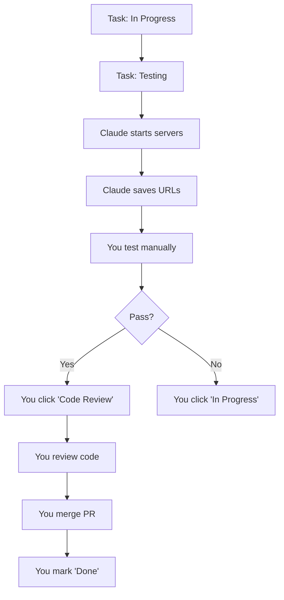
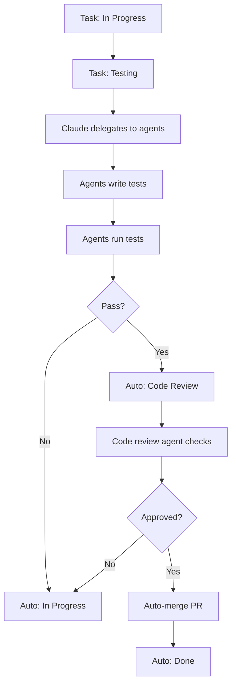

# Manual Mode Toggle Implementation

## ✅ Implementation Complete

**Date**: 2025-11-22
**Location**: TaskBoard Page (Top Navigation Bar)
**Status**: Ready to Use

## Overview

Implemented a **single `manual_mode` toggle** on the TaskBoard page that controls both:
- **UC-04 Testing**: Manual vs Automated testing
- **UC-05 Code Review**: Manual vs Auto-merge review

## UI Location

The toggle is located in the **top navigation bar** on the TaskBoard page, alongside the Project Mode indicator.

```
┌─────────────────────────────────────────────────────────────────┐
│ TaskBoard                                                        │
├─────────────────────────────────────────────────────────────────┤
│ Project Mode: [Development] Full workflow │ 👤 [MANUAL] ✓  │... │
│                                            └─────────────┘       │
└─────────────────────────────────────────────────────────────────┘
```

## Visual Design

### Manual Mode (ON)
```
👤 [MANUAL] ✓
   Blue color (#3b82f6)
   Person icon
```

### Automated Mode (OFF)
```
🤖 [AUTO] ✗
   Green color (#10b981)
   Robot icon
```

## How It Works

### 1. Toggle the Switch

Click the switch to toggle between Manual and Automated modes.

### 2. Automatic Save

- Settings are saved immediately to the backend
- CLAUDE.md is regenerated automatically
- No need to click a separate "Save" button

### 3. Mode Behavior

#### Manual Mode (Toggle ON)

**Testing (UC-04)**:
- Task reaches "Testing" status
- Claude starts test servers (frontend + backend)
- Claude saves testing URLs to task
- You test manually via browser
- You update status when done

**Code Review (UC-05)**:
- Task reaches "Code Review" status
- You review the code manually
- You merge the PR manually
- You mark task as "Done"

#### Automated Mode (Toggle OFF)

**Testing (UC-04)**:
- Task reaches "Testing" status
- Claude delegates to testing agents
- Agents write and run tests
- Reports generated in `/Tests/Report/`
- Status auto-updates based on results

**Code Review (UC-05)**:
- Task reaches "Code Review" status
- Code review agent analyzes PR
- If approved → Auto-merge to main
- Status auto-updates to "Done"

## Implementation Details

### Frontend

**File**: `claudetask/frontend/src/components/ProjectModeToggle.tsx`

**Key Features**:
- Located in navigation bar (always visible)
- Shows current mode with icon + badge
- Tooltip explains behavior
- Auto-saves on toggle
- Triggers CLAUDE.md regeneration

**State Management**:
```typescript
const [manualMode, setManualMode] = useState<boolean>(true);

const handleManualModeToggle = async (event) => {
  await updateProjectSettings(selectedProject.id, {
    manual_mode: newValue
  });
  await refreshProjects(); // Regenerates CLAUDE.md
};
```

### Backend

**Schema**: `claudetask/backend/app/schemas.py`

```python
class ProjectSettingsBase(BaseModel):
    manual_mode: bool = True  # Manual testing & review (true) vs Automated (false)
```

**Database**: `claudetask/backend/app/models.py`

```python
class ProjectSettings(Base):
    manual_mode = Column(Boolean, default=True, nullable=False)
```

**API Endpoint**:
- `GET /api/projects/{id}/settings` - Get current settings
- `PATCH /api/projects/{id}/settings` - Update settings

### MCP Integration

The setting is accessible via MCP command:

```bash
mcp__claudetask__get_project_settings
```

Returns:
```
Manual Mode: True (Manual testing & review)
```

## Testing the Toggle

### Step 1: Open TaskBoard
1. Navigate to http://localhost:5173
2. Open TaskBoard page
3. Look at the top navigation bar

### Step 2: Locate Toggle
You'll see: `Project Mode: [Development] | 👤 [MANUAL] ✓`

### Step 3: Toggle Mode
- Click the switch to change modes
- Badge updates: `[MANUAL]` ↔ `[AUTO]`
- Icon changes: 👤 ↔ 🤖
- Color changes: Blue ↔ Green

### Step 4: Verify
- Hover over toggle to see tooltip
- Check browser console for confirmation logs
- Run MCP command to verify backend update

## Workflow Impact

### Manual Mode Workflow



### Automated Mode Workflow



## Configuration Files

When you toggle the mode, these files are updated:

### 1. Database
- `project_settings.manual_mode` is updated

### 2. CLAUDE.md
- Automatically regenerated with new mode instructions
- Claude follows manual or automated workflow accordingly

### 3. Frontend State
- Component state updates immediately
- Visual indicator reflects new mode

## Troubleshooting

### Toggle Not Visible

**Issue**: Can't see manual mode toggle

**Solution**:
1. Ensure you're on the TaskBoard page
2. Look at the very top navigation bar
3. Refresh the page if needed
4. Check that a project is selected

### Toggle Not Saving

**Issue**: Toggle switches but doesn't persist

**Solution**:
1. Check browser console for errors
2. Verify backend is running (port 8000)
3. Check network tab for failed API calls
4. Try refreshing the page

### Mode Not Working

**Issue**: Toggled to AUTO but still manual workflow

**Solution**:
1. Stop any running Claude sessions
2. Start a new task to test
3. Verify with MCP command: `mcp__claudetask__get_project_settings`
4. Check that CLAUDE.md was regenerated

## Benefits

✅ **Always Visible**: Toggle is in navigation bar, not buried in settings
✅ **Quick Switch**: One click to change modes
✅ **Clear Indicator**: Visual badge shows current mode instantly
✅ **Auto-Save**: No need to remember to save
✅ **Consistent**: Same toggle controls both testing and review
✅ **Simple**: One setting instead of two separate toggles

## Migration Notes

### Old Approach (Removed)
- ❌ Separate `manual_testing_mode` and `manual_review_mode`
- ❌ Located in Settings page
- ❌ Required clicking "Save Changes" button

### New Approach (Current)
- ✅ Single `manual_mode` toggle
- ✅ Located on TaskBoard page (navigation bar)
- ✅ Auto-saves immediately

### Backwards Compatibility

The database still has the old fields for backwards compatibility:
```python
manual_testing_mode = Column(Boolean, default=True)  # Synced with manual_mode
manual_review_mode = Column(Boolean, default=True)   # Synced with manual_mode
```

But the UI now uses only `manual_mode`.

## Documentation References

- **Testing Workflow**: `.claudetask/instructions/testing-workflow.md`
- **Use Cases**: `Workflow/new_workflow_usecases.md` (UC-04, UC-05)
- **API Schemas**: `claudetask/backend/app/schemas.py`

---

**Last Updated**: 2025-11-22
**Status**: ✅ Production Ready
**Location**: TaskBoard Navigation Bar
