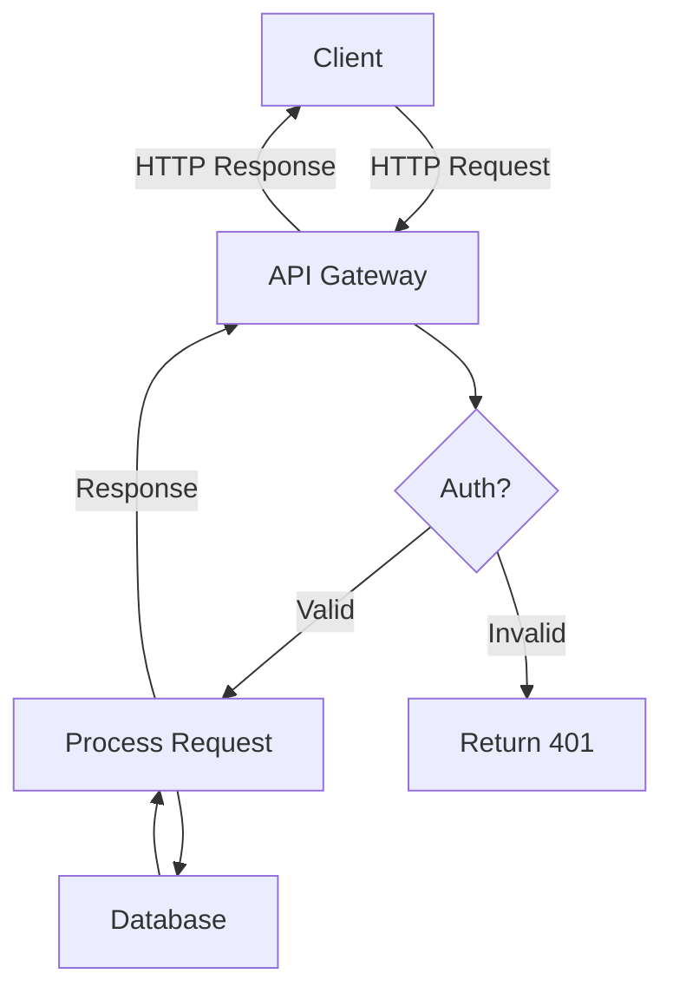
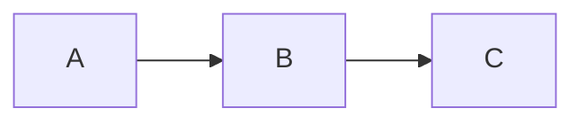
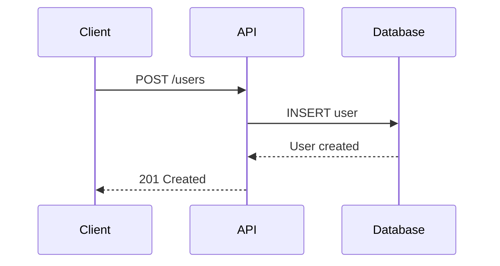
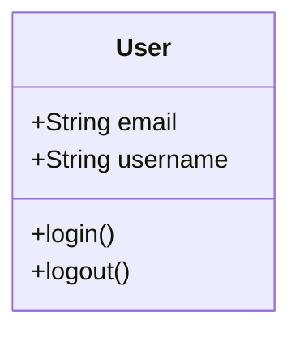
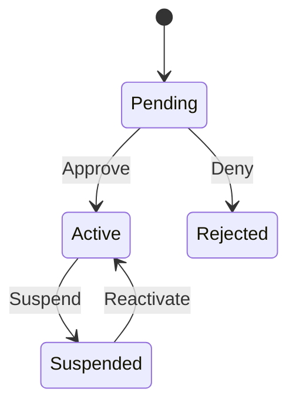
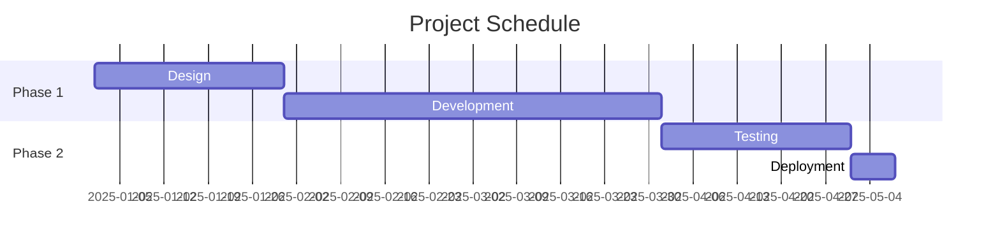
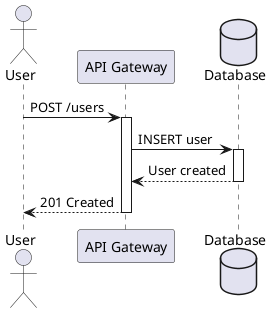
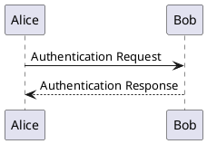

# Documentation Tools and Platforms Reference

## Table of Contents
- [Static Site Generators](#static-site-generators)
- [API Documentation Tools](#api-documentation-tools)
- [Markdown Processors](#markdown-processors)
- [Diagram Tools](#diagram-tools)
- [Search Solutions](#search-solutions)
- [Documentation Hosting](#documentation-hosting)
- [Translation Tools](#translation-tools)
- [Quality Assurance Tools](#quality-assurance-tools)
- [Code Documentation Generators](#code-documentation-generators)
- [Collaboration Platforms](#collaboration-platforms)

## Static Site Generators

### MkDocs

**Description:** Python-based documentation generator with Material theme support.

**Best For:** Technical documentation, API docs, software projects

**Installation:**
```bash
pip install mkdocs
pip install mkdocs-material  # Material theme
```

**Basic Configuration:**
```yaml
# mkdocs.yml
site_name: My Documentation
theme:
  name: material
  features:
    - navigation.tabs
    - navigation.sections
    - navigation.expand
    - search.suggest
    - search.highlight
  palette:
    - scheme: default
      primary: indigo
      accent: indigo
      toggle:
        icon: material/brightness-7
        name: Switch to dark mode
    - scheme: slate
      primary: indigo
      accent: indigo
      toggle:
        icon: material/brightness-4
        name: Switch to light mode

plugins:
  - search
  - git-revision-date-localized:
      enable_creation_date: true

nav:
  - Home: index.md
  - Getting Started:
    - Installation: getting-started/installation.md
    - Quick Start: getting-started/quickstart.md
  - Guides:
    - User Guide: guides/user-guide.md
    - Developer Guide: guides/developer-guide.md
  - API Reference: api/reference.md
```

**Commands:**
```bash
mkdocs serve       # Development server
mkdocs build      # Build static site
mkdocs gh-deploy  # Deploy to GitHub Pages
```

**Pros:**
- Simple setup
- Beautiful Material theme
- Good plugin ecosystem
- Python integration

**Cons:**
- Limited customization without plugins
- Python dependency

---

### Docusaurus

**Description:** React-based documentation framework by Facebook/Meta.

**Best For:** Modern web applications, large projects, versioned docs

**Installation:**
```bash
npx create-docusaurus@latest my-website classic
cd my-website
npm start
```

**Basic Configuration:**
```javascript
// docusaurus.config.js
module.exports = {
  title: 'My Documentation',
  tagline: 'Great documentation for great products',
  url: 'https://docs.example.com',
  baseUrl: '/',

  themeConfig: {
    navbar: {
      title: 'My Docs',
      items: [
        {
          type: 'doc',
          docId: 'intro',
          position: 'left',
          label: 'Tutorial',
        },
        {
          to: '/api',
          label: 'API',
          position: 'left'
        },
        {
          type: 'docsVersionDropdown',
          position: 'right',
        },
      ],
    },

    footer: {
      style: 'dark',
      links: [
        {
          title: 'Docs',
          items: [
            {
              label: 'Getting Started',
              to: '/docs/intro',
            },
          ],
        },
      ],
    },
  },

  presets: [
    [
      '@docusaurus/preset-classic',
      {
        docs: {
          sidebarPath: require.resolve('./sidebars.js'),
          editUrl: 'https://github.com/user/repo/edit/main/',
        },
        blog: {
          showReadingTime: true,
        },
        theme: {
          customCss: require.resolve('./src/css/custom.css'),
        },
      },
    ],
  ],
};
```

**Commands:**
```bash
npm start          # Development server
npm run build     # Build static site
npm run serve     # Preview build
```

**Pros:**
- Modern, React-based
- Excellent versioning support
- Great performance
- Customizable with React

**Cons:**
- More complex setup
- Node.js/React knowledge needed
- Larger build output

---

### Jekyll

**Description:** Ruby-based static site generator, GitHub Pages default.

**Best For:** GitHub projects, simple documentation sites

**Installation:**
```bash
gem install bundler jekyll
jekyll new my-docs
cd my-docs
bundle exec jekyll serve
```

**Basic Configuration:**
```yaml
# _config.yml
title: My Documentation
description: Documentation for my project
baseurl: ""
url: "https://docs.example.com"

theme: just-the-docs  # Popular docs theme

# Collections
collections:
  docs:
    output: true
    permalink: /:collection/:path/

# Defaults
defaults:
  - scope:
      path: ""
      type: "docs"
    values:
      layout: "default"
```

**Pros:**
- GitHub Pages integration
- Large theme ecosystem
- Mature and stable

**Cons:**
- Ruby dependency
- Slower build times
- Less modern than alternatives

---

## API Documentation Tools

### Swagger/OpenAPI

**Description:** Industry-standard API specification and documentation.

**OpenAPI Specification:**
```yaml
openapi: 3.0.0
info:
  title: User API
  version: 1.0.0
  description: API for managing users

servers:
  - url: https://api.example.com
    description: Production
  - url: https://staging.example.com
    description: Staging

paths:
  /users:
    get:
      summary: List users
      parameters:
        - name: limit
          in: query
          schema:
            type: integer
            default: 10
            minimum: 1
            maximum: 100
      responses:
        '200':
          description: List of users
          content:
            application/json:
              schema:
                type: array
                items:
                  $ref: '#/components/schemas/User'

components:
  schemas:
    User:
      type: object
      required:
        - id
        - email
      properties:
        id:
          type: string
          example: usr_123
        email:
          type: string
          format: email
          example: user@example.com
```

**Tools:**

1. **Swagger UI** - Interactive documentation
```bash
npm install -g swagger-ui-watcher
swagger-ui-watcher -p 8080 openapi.yml
```

2. **ReDoc** - Clean, three-panel documentation
```bash
npm install -g redoc-cli
redoc-cli bundle openapi.yml
```

3. **Swagger Codegen** - Generate client SDKs
```bash
swagger-codegen generate \
  -i openapi.yml \
  -l python \
  -o ./client
```

**Pros:**
- Industry standard
- Machine-readable
- Auto-generates interactive docs
- SDK generation

**Cons:**
- Can be verbose
- Learning curve for spec

---

### Postman

**Description:** API development and documentation platform.

**Features:**
- Interactive API testing
- Auto-generated documentation
- Team collaboration
- Mock servers

**Generating Documentation:**
```javascript
// Postman collection with documentation
{
  "info": {
    "name": "User API",
    "description": "API for user management",
    "schema": "https://schema.getpostman.com/json/collection/v2.1.0/"
  },
  "item": [
    {
      "name": "Create User",
      "request": {
        "method": "POST",
        "header": [
          {
            "key": "Authorization",
            "value": "Bearer {{token}}"
          }
        ],
        "body": {
          "mode": "raw",
          "raw": "{\n  \"email\": \"user@example.com\",\n  \"username\": \"johndoe\"\n}"
        },
        "url": "{{baseUrl}}/users",
        "description": "Create a new user account"
      },
      "response": [
        {
          "name": "Success",
          "status": "Created",
          "code": 201,
          "body": "{\n  \"id\": \"usr_123\",\n  \"email\": \"user@example.com\"\n}"
        }
      ]
    }
  ]
}
```

**Publishing:**
```bash
# Export collection and publish
postman collection publish \
  --collection-id <id> \
  --env-id <env-id>
```

**Pros:**
- Easy to use
- Interactive testing
- Team features
- Cloud hosting

**Cons:**
- Proprietary platform
- Limited customization
- Requires Postman account

---

### Read the Docs

**Description:** Documentation hosting and building platform.

**Configuration:**
```.readthedocs.yml
# .readthedocs.yml
version: 2

build:
  os: ubuntu-22.04
  tools:
    python: "3.11"

sphinx:
  configuration: docs/conf.py
  fail_on_warning: true

python:
  install:
    - requirements: docs/requirements.txt
    - method: pip
      path: .

formats:
  - pdf
  - epub
```

**Sphinx Configuration:**
```python
# docs/conf.py
project = 'My Project'
copyright = '2025, Author'
author = 'Author'

extensions = [
    'sphinx.ext.autodoc',
    'sphinx.ext.napoleon',
    'sphinx.ext.viewcode',
    'sphinx_rtd_theme',
]

templates_path = ['_templates']
exclude_patterns = ['_build']

html_theme = 'sphinx_rtd_theme'
html_static_path = ['_static']
```

**Pros:**
- Free for open source
- Automatic builds
- Version management
- PDF/ePub generation

**Cons:**
- Sphinx learning curve
- Limited customization
- Slower builds

---

## Markdown Processors

### Marked.js

**Description:** Fast markdown parser for JavaScript.

**Usage:**
```javascript
const marked = require('marked');

// Basic usage
const html = marked.parse('# Hello\n\nThis is **markdown**.');

// With options
marked.setOptions({
  highlight: function(code, lang) {
    return require('highlight.js').highlight(code, { language: lang }).value;
  },
  pedantic: false,
  gfm: true,
  breaks: false,
  sanitize: false,
  smartLists: true,
  smartypants: false,
  xhtml: false
});

// Custom renderer
const renderer = new marked.Renderer();
renderer.heading = function(text, level) {
  const escapedText = text.toLowerCase().replace(/[^\w]+/g, '-');
  return `
    <h${level} id="${escapedText}">
      <a href="#${escapedText}">${text}</a>
    </h${level}>
  `;
};

marked.use({ renderer });
```

---

### Python-Markdown

**Description:** Python implementation of Markdown.

**Usage:**
```python
import markdown

# Basic usage
html = markdown.markdown('# Hello\n\nThis is **markdown**.')

# With extensions
md = markdown.Markdown(extensions=[
    'extra',
    'codehilite',
    'toc',
    'tables',
    'fenced_code'
])

html = md.convert(text)

# Custom extension
class MyExtension(markdown.Extension):
    def extendMarkdown(self, md):
        md.preprocessors.register(MyPreprocessor(md), 'my_preprocessor', 100)

# Register custom extension
markdown.markdown(text, extensions=[MyExtension()])
```

---

## Diagram Tools

### Mermaid

**Description:** Text-based diagram generation.

**Syntax:**
````markdown

````

**Types of Diagrams:**
```markdown
<!-- Flowchart -->


<!-- Sequence Diagram -->


<!-- Class Diagram -->


<!-- State Diagram -->


<!-- Gantt Chart -->

```

**Integration:**
```html
<!-- In HTML -->
<script src="https://cdn.jsdelivr.net/npm/mermaid/dist/mermaid.min.js"></script>
<script>mermaid.initialize({ startOnLoad: true });</script>
```

---

### PlantUML

**Description:** UML diagram generator from text.

**Syntax:**


**Types:**


**Generation:**
```bash
# Command line
plantuml diagram.puml

# Docker
docker run -v $(pwd):/data plantuml/plantuml diagram.puml
```

---

## Search Solutions

### Algolia DocSearch

**Description:** Free search for open-source documentation.

**Configuration:**
```javascript
// docsearch.js
docsearch({
  apiKey: 'YOUR_API_KEY',
  indexName: 'your_index_name',
  inputSelector: '#search-input',
  debug: false,
  algoliaOptions: {
    hitsPerPage: 10,
    facetFilters: ['version:2.0']
  }
});
```

**Crawler Configuration:**
```json
{
  "index_name": "my_docs",
  "start_urls": ["https://docs.example.com/"],
  "selectors": {
    "lvl0": "header h1",
    "lvl1": "article h2",
    "lvl2": "article h3",
    "lvl3": "article h4",
    "text": "article p, article li"
  }
}
```

---

### Lunr.js

**Description:** Client-side full-text search.

**Usage:**
```javascript
// Build index
var idx = lunr(function () {
  this.field('title', { boost: 10 })
  this.field('body')
  this.ref('id')

  documents.forEach(function (doc) {
    this.add(doc)
  }, this)
})

// Search
var results = idx.search('user authentication')

// With wildcards
var results = idx.search('auth*')

// Field-specific search
var results = idx.search('title:authentication')
```

---

## Documentation Hosting

### GitHub Pages

**Description:** Free static site hosting from GitHub.

**Setup:**
```yaml
# .github/workflows/deploy-docs.yml
name: Deploy Documentation

on:
  push:
    branches: [main]

jobs:
  deploy:
    runs-on: ubuntu-latest
    steps:
      - uses: actions/checkout@v3

      - name: Setup Python
        uses: actions/setup-python@v4
        with:
          python-version: '3.11'

      - name: Install dependencies
        run: pip install mkdocs-material

      - name: Build documentation
        run: mkdocs build

      - name: Deploy to GitHub Pages
        uses: peaceiris/actions-gh-pages@v3
        with:
          github_token: ${{ secrets.GITHUB_TOKEN }}
          publish_dir: ./site
```

**Custom Domain:**
```
# CNAME file in docs/
docs.example.com
```

---

### Netlify

**Description:** Modern hosting with continuous deployment.

**Configuration:**
```toml
# netlify.toml
[build]
  command = "mkdocs build"
  publish = "site/"

[[redirects]]
  from = "/old-page"
  to = "/new-page"
  status = 301

[[headers]]
  for = "/*"
  [headers.values]
    X-Frame-Options = "DENY"
    X-Content-Type-Options = "nosniff"
```

---

### Vercel

**Description:** Fast, global hosting for modern sites.

**Configuration:**
```json
{
  "buildCommand": "mkdocs build",
  "outputDirectory": "site",
  "devCommand": "mkdocs serve",
  "installCommand": "pip install -r requirements.txt"
}
```

---

## Translation Tools

### Crowdin

**Description:** Localization management platform.

**Configuration:**
```yaml
# crowdin.yml
project_id: "12345"
api_token_env: CROWDIN_TOKEN

files:
  - source: /docs/en/**/*.md
    translation: /docs/%two_letters_code%/**/%original_file_name%
```

**CLI Usage:**
```bash
# Upload source files
crowdin upload sources

# Download translations
crowdin download

# Build and export
crowdin download --export-only-approved
```

---

### Transifex

**Description:** Translation management system.

**Configuration:**
```ini
# .tx/config
[main]
host = https://www.transifex.com

[project.docs]
file_filter = locales/<lang>/LC_MESSAGES/messages.po
source_file = locales/en/LC_MESSAGES/messages.po
source_lang = en
type = PO
```

---

## Quality Assurance Tools

### Vale

**Description:** Syntax-aware linter for prose.

**Configuration:**
```ini
# .vale.ini
StylesPath = styles
MinAlertLevel = suggestion

[*.md]
BasedOnStyles = Vale, write-good
```

**Style Rules:**
```yaml
# styles/MyStyle/TooWordy.yml
extends: existence
message: "Consider using '%s' instead of '%s'"
level: warning
ignorecase: true
swap:
  "due to the fact that": "because"
  "in order to": "to"
  "at this point in time": "now"
```

**Usage:**
```bash
# Lint all markdown
vale docs/

# Lint specific files
vale docs/guide.md

# Output formats
vale --output=JSON docs/
```

---

### markdownlint

**Description:** Markdown style checker.

**Configuration:**
```json
{
  "default": true,
  "MD013": false,
  "MD033": false,
  "MD041": false,
  "line-length": {
    "line_length": 120,
    "code_blocks": false
  }
}
```

**Usage:**
```bash
# Lint files
markdownlint docs/**/*.md

# Fix automatically
markdownlint --fix docs/**/*.md

# With custom config
markdownlint --config .markdownlint.json docs/
```

---

## Code Documentation Generators

### JSDoc

**Description:** JavaScript documentation generator.

**Usage:**
```javascript
/**
 * Create a new user account.
 *
 * @param {Object} userData - User information
 * @param {string} userData.email - User's email address
 * @param {string} userData.username - Desired username
 * @param {string} [userData.role='user'] - User role
 * @returns {Promise<User>} Created user object
 * @throws {ValidationError} If email or username is invalid
 *
 * @example
 * const user = await createUser({
 *   email: 'john@example.com',
 *   username: 'johndoe'
 * });
 */
async function createUser(userData) {
  // Implementation
}
```

**Generate Docs:**
```bash
jsdoc src/ -d docs/api -c jsdoc.json
```

---

### Sphinx (Python)

**Description:** Python documentation generator.

**Usage:**
```python
def create_user(email: str, username: str, role: str = "user") -> dict:
    """
    Create a new user account.

    Args:
        email (str): User's email address. Must be valid and unique.
        username (str): Desired username. Must be 3-20 alphanumeric characters.
        role (str, optional): User role. Defaults to "user".

    Returns:
        dict: Created user object with keys: id, email, username, role, created_at

    Raises:
        ValueError: If email or username is invalid
        DuplicateError: If email or username already exists

    Example:
        >>> user = create_user(
        ...     email="john@example.com",
        ...     username="johndoe"
        ... )
        >>> print(user["id"])
        'usr_123'

    Note:
        This function sends a welcome email asynchronously.
    """
    pass
```

**Generate Docs:**
```bash
sphinx-apidoc -o docs/api src/
sphinx-build -b html docs/ docs/_build
```

---

### Doxygen

**Description:** Multi-language documentation generator.

**Usage (C++):**
```cpp
/**
 * @brief Create a new user account.
 *
 * @param email User's email address
 * @param username Desired username (3-20 characters)
 * @param role User role (default: "user")
 * @return User object if successful
 * @throws std::invalid_argument If email or username invalid
 *
 * @code
 * User user = createUser("john@example.com", "johndoe");
 * @endcode
 */
User createUser(const std::string& email,
                const std::string& username,
                const std::string& role = "user");
```

**Configuration:**
```
# Doxyfile
PROJECT_NAME = "My Project"
OUTPUT_DIRECTORY = docs/
INPUT = src/
RECURSIVE = YES
GENERATE_HTML = YES
GENERATE_LATEX = NO
```

---

## Collaboration Platforms

### Notion

**Description:** All-in-one workspace for documentation.

**Features:**
- WYSIWYG editing
- Databases and tables
- Team collaboration
- API for automation

**API Usage:**
```javascript
const { Client } = require('@notionhq/client');

const notion = new Client({ auth: process.env.NOTION_TOKEN });

// Create a page
await notion.pages.create({
  parent: { database_id: databaseId },
  properties: {
    title: {
      title: [{
        text: { content: 'New Documentation Page' }
      }]
    }
  },
  children: [
    {
      object: 'block',
      type: 'heading_1',
      heading_1: {
        rich_text: [{ type: 'text', text: { content: 'Getting Started' } }]
      }
    }
  ]
});
```

---

### Confluence

**Description:** Enterprise wiki and collaboration tool.

**API Usage:**
```python
from atlassian import Confluence

confluence = Confluence(
    url='https://your-domain.atlassian.net',
    username='email@example.com',
    password='api_token'
)

# Create page
confluence.create_page(
    space='DOC',
    title='API Documentation',
    body='<p>Content here</p>',
    parent_id=parent_page_id
)

# Update page
confluence.update_page(
    page_id=page_id,
    title='Updated Title',
    body='<p>Updated content</p>'
)
```

---

## Related Topics

- **Implementation Guides**: See [advanced-topics.md](advanced-topics.md)
- **Best Practices**: See [best-practices.md](best-practices.md)
- **Tool Selection**: See [patterns.md](patterns.md)
- **Troubleshooting**: See [troubleshooting.md](troubleshooting.md)
